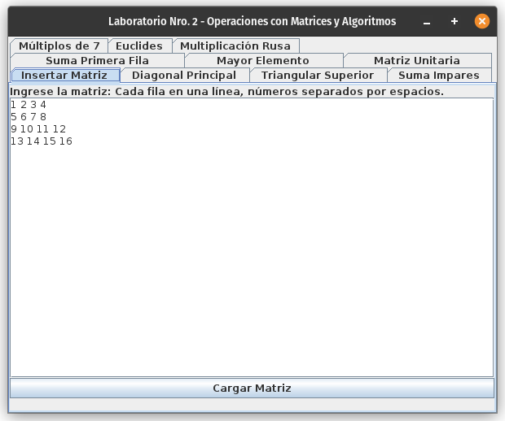
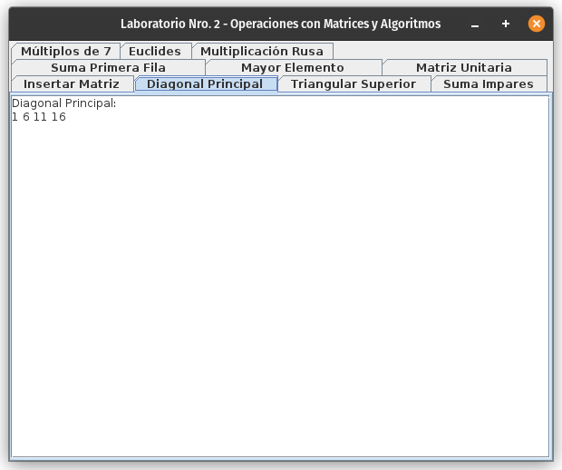
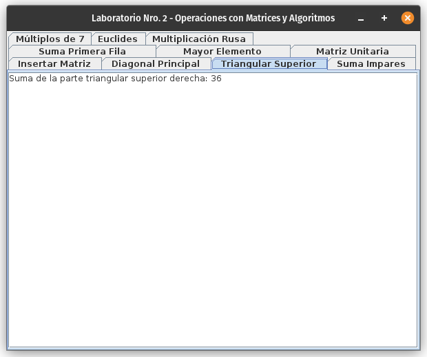
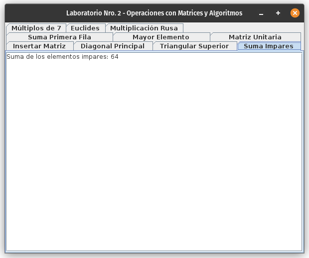
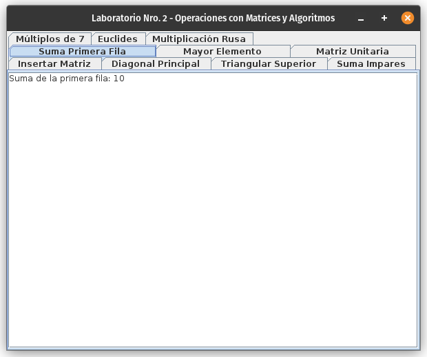
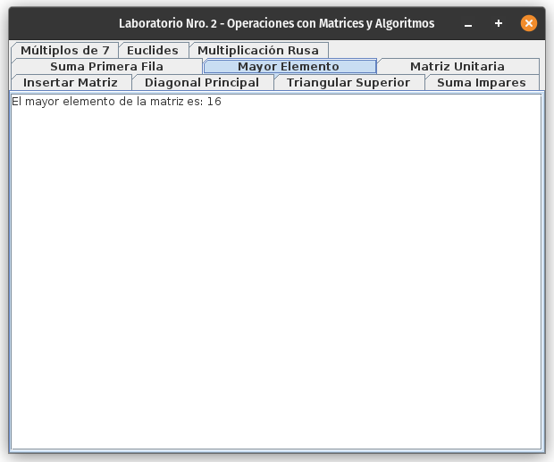
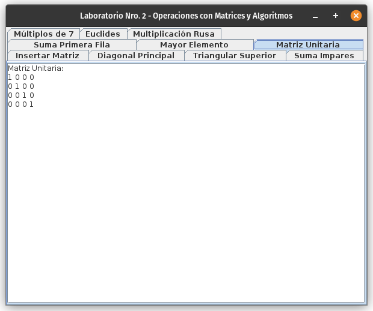
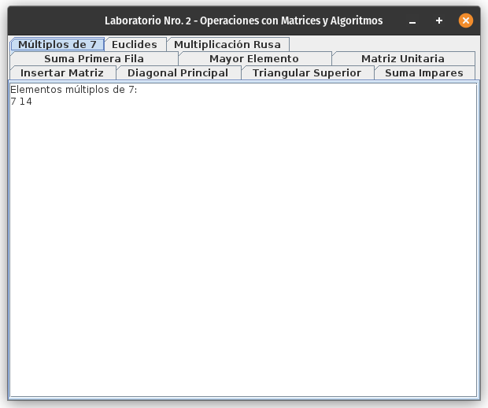
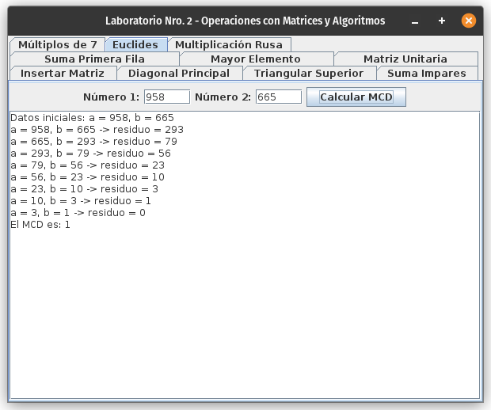
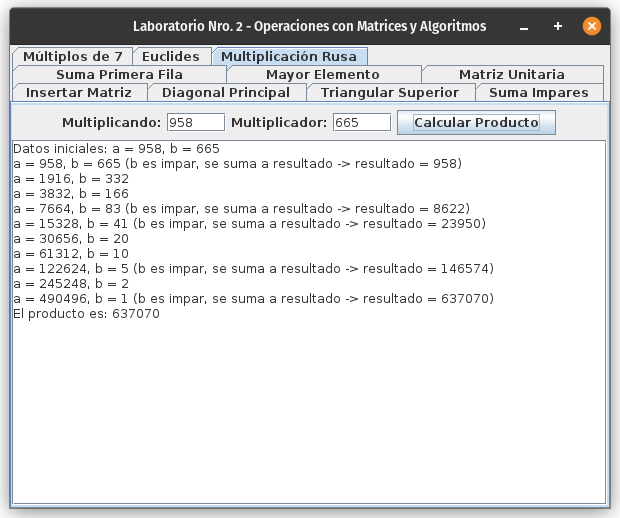

# Laboratorio N°2 - Operaciones con Matrices y Algoritmos {.unlisted .unnumbered}

**Programación Avanzada**

\begin{tabular}{|c|c|c|c|}
\hline
\textbf{Nombres} & \textbf{Apellidos} & \textbf{Carnet} & \textbf{Iniciales} \\
\hline
Andres Humberto & Chirinos Lizondo & 13280260 & C \\
\hline
\end{tabular}

# Marco Práctico

## Introducción

Tomemos la siguiente matriz de referencia para los siguiente algoritmos

$$
M = \begin{bmatrix}
1 & 2 & 3 & 4 \\
5 & 6 & 7 & 8 \\
9 & 10 & 11 & 12 \\
13 & 14 & 15 & 16
\end{bmatrix}
$$

{width="450"}

## Mostrar los elementos de la diagonal principal de una Matriz cuadrada

``` java
private void actualizarDiagonal() {
    StringBuilder salida = new StringBuilder("Diagonal Principal:\n");
    for (int i = 0; i < matriz.length; i++) {
        salida.append(matriz[i][i]).append(" ");
    }
    diagTextArea.setText(salida.toString());
}
```

{width="450"}

## Sumar los elementos de la triangular superior derecha

``` java
private void actualizarTriangularSuperior() {
    int suma = 0;
    for (int i = 0; i < matriz.length; i++) {
        for (int j = i + 1; j < matriz[i].length; j++) {
            suma += matriz[i][j];
        }
    }
    triSupTextArea.setText("Suma de la parte triangular superior derecha: " + suma);
}
```

{width="450"}

## Sumar los elementos impares de la matriz

``` java
private void actualizarSumaImpares() {
    int suma = 0;
    for (int[] fila : matriz) {
        for (int valor : fila) {
            if (valor % 2 != 0) {
                suma += valor;
            }
        }
    }
    sumaImparesTextArea.setText("Suma de los elementos impares: " + suma);
}
```

{width="450"}

## Sumar los elementos de la primera fila

``` java
private void actualizarSumaPrimeraFila() {
    int suma = 0;
    for (int valor : matriz[0]) {
        suma += valor;
    }
    sumaPrimeraFilaTextArea.setText("Suma de la primera fila: " + suma);
}
```

{width="450"}

## Mostrar el mayor elemento de la matriz

``` java
private void actualizarMayorElemento() {
    int mayor = matriz[0][0];
    for (int[] fila : matriz) {
        for (int valor : fila) {
            if (valor > mayor) {
                mayor = valor;ctions: true
            }
        }
    }
    mayorElementoTextArea.setText("El mayor elemento de la matriz es: " + mayor);
}
```

{width="450"}

## Generar la matriz unitaria

``` java
private void actualizarMatrizUnitaria() {
    int n = matriz.length;
    int[][] identidad = new int[n][n];
    for (int i = 0; i < n; i++) {
        identidad[i][i] = 1;
    }
    StringBuilder salida = new StringBuilder("Matriz Unitaria:\n");
    for (int[] fila : identidad) {
        for (int valor : fila) {
            salida.append(valor).append(" ");
        }
        salida.append("\n");
    }
    matrizUnitariaTextArea.setText(salida.toString());
}
```

{width="450"}

## Mostrar los elementos múltiplos de 7 de una matriz

``` java
private void actualizarMultiplosSiete() {
    StringBuilder salida = new StringBuilder("Elementos múltiplos de 7:\n");
    for (int[] fila : matriz) {
        for (int valor : fila) {
            if (valor % 7 == 0) {
                salida.append(valor).append(" ");
            }
        }
    }
    multiplosSieteTextArea.setText(salida.toString());
}
```

{width="450"}

## Algoritmo de Euclides

Para este algoritmo tome en consideración el siguiente caso de prueba $a = 958 \quad b = 665$

``` java
private String calcularMCD(int a, int b) {
    StringBuilder proceso = new StringBuilder();
    proceso.append("Datos iniciales: a = ").append(a).append(", b = ")
    .append(b).append("\n");
    while (b != 0) {
        int residuo = a % b;
        proceso.append("a = ").append(a).append(", b = ").append(b)
                  .append(" -> residuo = ").append(residuo).append("\n");
        a = b;
        b = residuo;
    }
    proceso.append("El MCD es: ").append(a);
    return proceso.toString();
}
```

@knuth1997art

{width="450"}

## Algoritmo de la multiplicación Rusa

Para este algoritmo tome en consideración el siguiente caso de prueba $a = 958 \quad b = 665$

``` java
private String multiplicacionRusaConProceso(int a, int b) {
    StringBuilder proceso = new StringBuilder();
    proceso.append("Datos iniciales: a = ").append(a).append(", b = ")
    .append(b).append("\n");
    int resultado = 0;
    while (b > 0) {
        proceso.append("a = ").append(a).append(", b = ").append(b);
        if (b % 2 != 0) {
            resultado += a;
            proceso.append(" (b es impar, se suma a resultado -> resultado = ")
            .append(resultado).append(")");
        }
        proceso.append("\n");
        a *= 2;
        b /= 2;
    }
    proceso.append("El producto es: ").append(resultado);
    return proceso.toString();
}
```

@knuth1997art

{width="450"}

# Bibliografia {.unnumbered}

::: {#refs}
:::

# Apendice {.appendix .unnumbered}

Los codigos usados se encuentran en el [repositorio público https://github.com/andres-chirinos/notes](https://github.com/andres-chirinos/notes/content/1.%20Cursos%20y%20Apuntes/Programación%20Avanzada/Laboratorio%20N°2)